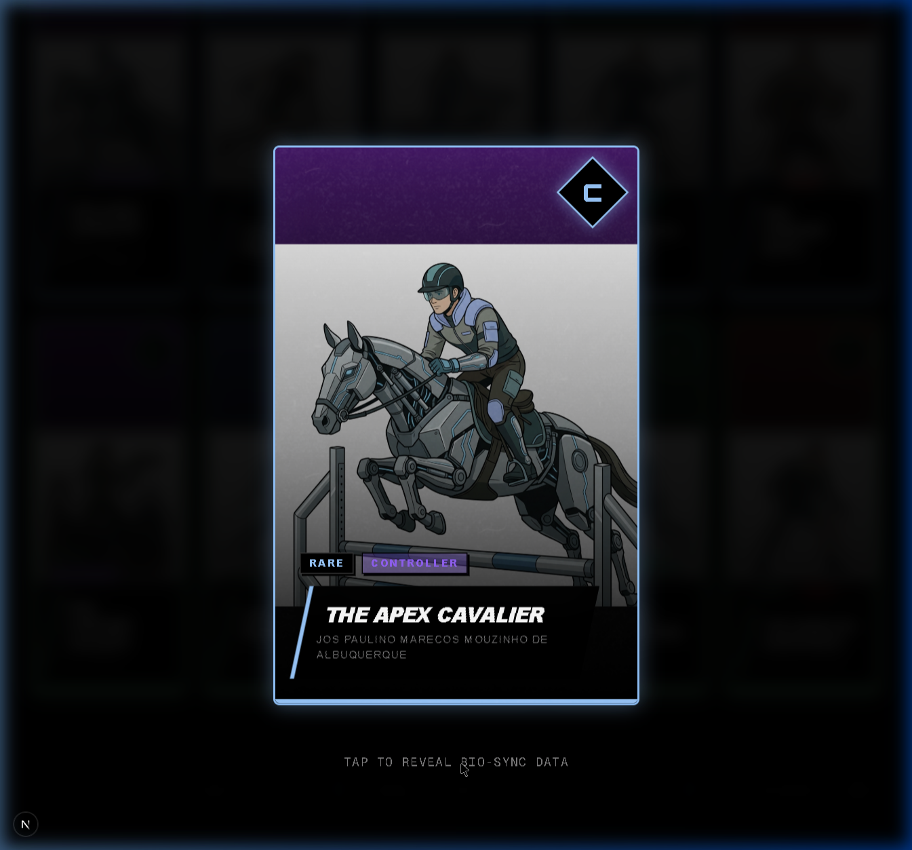
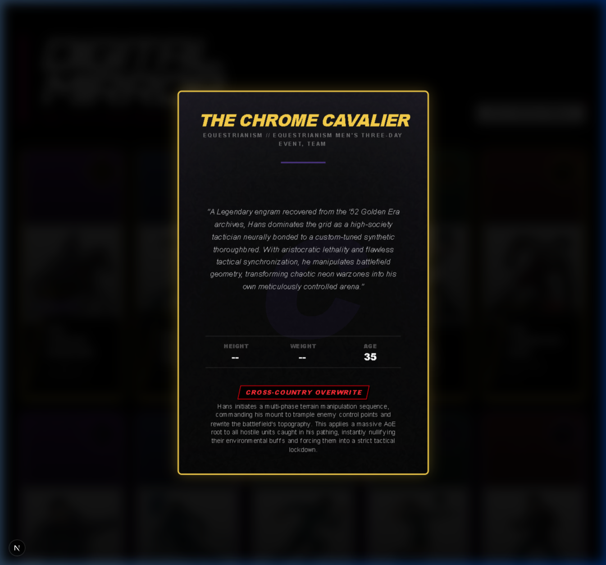
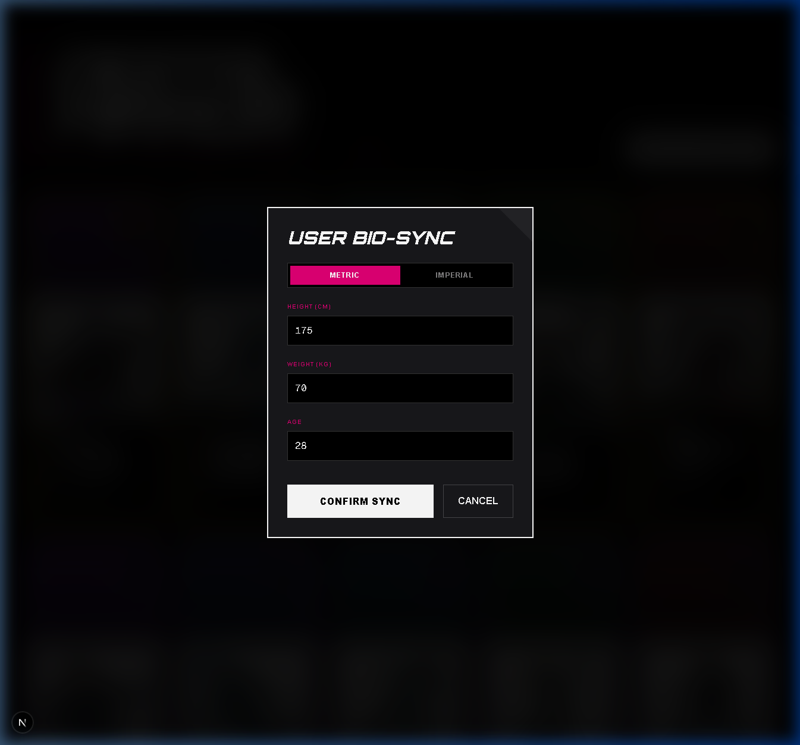

# DIGITAL MIRROR // USER GUIDE

> *Learn how to read your hero cards and sync your biometrics into the system.*

---

## TABLE OF CONTENTS

1. [Reading Your Cards — Front Face](#reading-your-cards--front-face)
2. [Reading Your Cards — Bio-Sheet (Back)](#reading-your-cards--bio-sheet-back)
3. [How to Use Re-Sync Biometrics](#how-to-use-re-sync-biometrics)

---

## Reading Your Cards — Front Face

Every hero card in Digital Mirror contains layered information designed to communicate the athlete's identity, rarity, and combat role at a glance.

### Card Front Anatomy

| Element | Location | Description |
|---------|----------|-------------|
| **Portrait Art** | Center | AI-generated vector-comic illustration of the hero-athlete in a dynamic action pose. Each portrait is unique to the athlete's sport. |
| **Rarity Badge** | Bottom-Left | Indicates the card's tier: `LEGENDARY`, `EPIC`, `RARE`, or `COMMON`. The badge color matches the card's border glow. |
| **Archetype Badge** | Bottom-Left (next to Rarity) | Shows the hero's MMO role: `TANK`, `DPS`, `DPS (DOT)`, `SUPPORT`, or `CONTROLLER`. Color-coded to the archetype's theme. |
| **Archetype Diamond** | Top-Right | A rotated diamond icon containing the archetype's letter designation (`T`, `D`, `S`, or `C`). Uses the rarity tier's color. |
| **Hero Alias** | Bottom-Left (large text) | The operative's cyberpunk codename (e.g., *"The Chrome Cavalier"*). Displayed in bold italic uppercase. |
| **Archetype Badge** | Bottom-Left (next to Alias) | Shows the hero's MMO role: `TANK`, `DPS`, `DPS (DOT)`, `SUPPORT`, or `CONTROLLER`. Color-coded to the archetype's theme. |
| **Rarity Glow Border** | Card Edge | A neon glow effect around the entire card that matches the rarity tier color (Gold, Purple, Blue, or Green). |
| **Archetype Gradient** | Background | A subtle color gradient behind the portrait that shifts based on the hero's archetype (e.g., crimson for Tank, blue for DPS). |

### How to Interact with Cards

1. **Hover** over any card in the grid to see a subtle scale-up animation.
2. **Click** any card to open it in the **Expanded Modal View** — a full-screen cinematic display.
3. In the modal, **click the card again** to flip it and reveal the Bio-Sheet on the back.
4. **Click the dark backdrop** behind the card to close the modal.

> 💡 *Look for the "TAP TO REVEAL BIO-SYNC DATA" hint below the card in the expanded view.*

---

## Reading Your Cards — Bio-Sheet (Back)

The back of each card contains the hero's full dossier — their lore, biometric stats, and combat ability.

### Bio-Sheet Anatomy

| Element | Location | Description |
|---------|----------|-------------|
| **Hero Alias** | Top (Gold/Purple/Blue/Green) | The operative's codename, displayed in the rarity tier's accent color. |
| **Sport // Event** | Below Alias | The athlete's real-world sport and specific Olympic/Paralympic event. |
| **Character Lore** | Center (Italic) | A narrative paragraph describing the hero's backstory, personality, and role within the cyberpunk resistance. Written in-universe. |
| **Biometric Stats Grid** | Below Lore | Three columns: **Height**, **Weight**, and **Age**. Displays the athlete's real data. |
| **Diff Math** | Below Each Stat | If Bio-Sync is active, shows the difference between YOUR stats and the hero's. Green (`+`) means you exceed the hero; Red (`-`) means the hero exceeds you. |
| **Ability Name** | Red Tag | The hero's signature combat ability, styled as a bold red keyword tag (e.g., `CROSS-COUNTRY OVERWRITE`). |
| **Ability Description** | Below Ability Name | A detailed description of what the ability does in combat, written in MMO-style game mechanics language. |
| **Archetype Watermark** | Background (5% opacity) | A massive, faded archetype letter (`T`, `D`, `S`, or `C`) behind the content as a subtle brand element. |

### Understanding the Stats Grid

The stats grid displays biometric data in the user's chosen unit system:

| Unit System | Height Format | Weight Format |
|-------------|---------------|---------------|
| **Metric** | `175 cm` | `70 kg` |
| **Imperial** | `5'9"` | `154 lbs` |

When Bio-Sync is active, the **Diff Math** row appears below each stat:
- `+5cm` (green) = You are 5cm taller than the hero
- `-12kg` (red) = The hero weighs 12kg more than you
- `28yr` (gray) = Your synced age, for reference

---

## How to Use Re-Sync Biometrics

The Bio-Sync system is the core interactive feature of Digital Mirror. It lets you input your own physical stats and see how you compare to every hero in the database — in real time.

### Step 1: Open the Bio-Sync Panel

Click the **"SYNC YOUR BIOMETRICS"** button in the top-right corner of the page.

### Step 2: Choose Your Unit System

At the top of the Bio-Sync modal, you'll see a toggle switch:

- **METRIC** — Input height in centimeters (cm) and weight in kilograms (kg)
- **IMPERIAL** — Input height in feet and inches (ft/in) and weight in pounds (lbs)

The toggle applies globally — all 20 cards will instantly convert their displayed stats to match your chosen system.

### Step 3: Enter Your Stats

Fill in the three input fields:

| Field | Metric Example | Imperial Example | Rules |
|-------|---------------|-----------------|-------|
| **Height** | `175` (cm) | `5` ft `9` in | Positive integers only. No decimals or negative numbers. |
| **Weight** | `70` (kg) | `154` (lbs) | Positive integers only. No decimals or negative numbers. |
| **Age** | `28` | `28` | Positive integers only. Same in both systems. |

> ⚠️ *The input fields have strict validation. You cannot enter negative numbers, decimals, or non-numeric characters. The system blocks invalid keystrokes at the keyboard level.*

### Step 4: Confirm Sync

Click **"CONFIRM SYNC"** to push your biometric data across the entire card database. All 20 hero cards will immediately update their Bio-Sheet stats grid with your personalized Diff Math.

### Step 5: Compare

Flip any card to its Bio-Sheet back and look at the stats grid. You'll see:

- **Green numbers** (`+`) where you exceed the hero's stats
- **Red numbers** (`-`) where the hero exceeds your stats
- Your **synced age** displayed as a reference point

This creates a deeply personal, data-driven connection between you and each athlete — turning abstract Olympic records into a tangible, relatable comparison.

### Re-Syncing or Canceling

- Click **"SYNC YOUR BIOMETRICS"** again at any time to update your stats
- Click **"CANCEL"** to close the modal without saving changes
- Your synced data persists across page interactions until you refresh the browser

---

*Verified by Vertex AI // Gemini 2.0 Flash — Hackathon 2026 // Project: Hero Identity*
