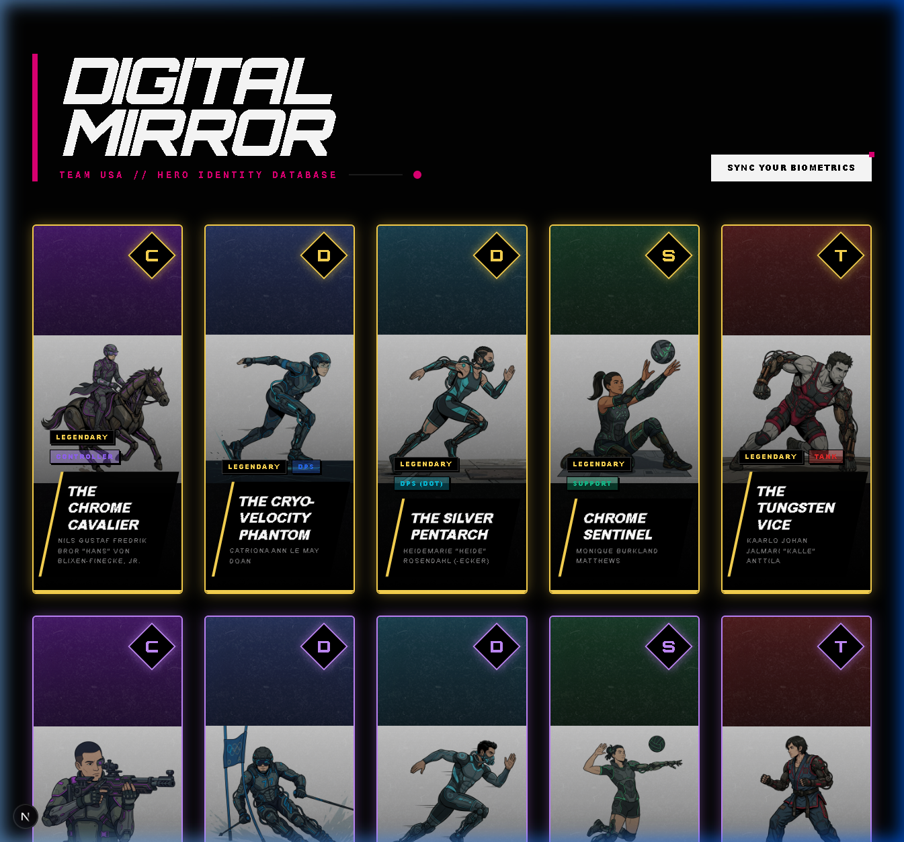

# Team USA: Hero Identity
## Digital Mirror // TCG Evolution

> [!TIP]
> **View this project on Devpost:** [Team USA: Hero Identity](https://devpost.com/software/team-usa-hero-identity)

> *What if the world's greatest Olympic and Paralympic archetypes were reborn as cyberpunk operatives in a neon-drenched MMO?*

**Digital Mirror** is an interactive trading card experience that transforms athletic excellence into 20 fully realized cyberpunk hero-operatives — featuring high-fidelity AI portraits, MMO-inspired archetypes, and a personalized biometric comparison system.

Built for the **Google Cloud Hackathon 2026**, this project showcases the power of Vertex AI, BigQuery, and generative AI to reimagine athletic heritage through the lens of gaming culture, while maintaining a **100% anonymous, data-driven approach**.



---

## TABLE OF CONTENTS

1. [What is Digital Mirror?](#what-is-digital-mirror)
2. [Tech Stack](#tech-stack)
3. [Getting Started](#getting-started)
4. [FAQ](#faq)
5. [Documentation](#documentation)
6. [Credits](#credits)

---

## What is Digital Mirror?

Digital Mirror bridges the gap between **international athletics** and **gaming culture** by asking a simple question: *How do you stack up against the greatest archetypes in history?*

Every card in the system represents the physical "DNA" of an Olympic or Paralympic discipline. Utilizing anonymous biographical data — height, weight, age, sport, medal count — the system generates:

- **Olympic & Paralympic Parity**: A balanced roster of 16 Olympic and 4 Paralympic hero-archetypes across all rarity tiers.
- **Veteran Factor (New)**: A multi-game longevity algorithm that boosts stats based on real-world competitive history (Rewards multi-cycle athletes with +Utility and +Endurance).
- **Rarity Tiers** based on historical achievement (Legendary, Epic, Rare, Common).
- **MMO Archetypes** mapped from their sport discipline (Tank, DPS, Support, Controller).
- **Character Lore** and **Combat Abilities** synthesized by Vertex AI.
- **AI-Generated Portraits** using **Vertex AI Imagen 3** with a refined industrial-punk prompt pipeline.

The user can then **sync their own biometrics** (height, weight, age) to activate the **Digital Mirror Neural Sync**, which calculates a real-time **Sync Score (%)** based on their alignment with the hero's physical stats.

---

## Tech Stack

| Layer | Technology | Purpose |
|-------|-----------|---------|
| **Data Pipeline** | Google BigQuery | Anonymous Olympic/Paralympic athlete metadata |
| **AI Generation** | Vertex AI (Gemini 3.1 Pro) | Character lore, ability descriptions, archetype mapping |
| **Art Generation** | Vertex AI (Imagen 3) | 20 high-fidelity vector-comic character portraits |
| **Frontend** | Next.js 16.2 + React 19.2 | Interactive 3D card-flip UI with expanded modal views |
| **Styling** | Tailwind CSS 4.0 | Responsive 5×4 grid layout with dynamic neon glow effects |
| **State Management** | React Context API | Global biometric sync with Metric/Imperial unit toggle |

---

## Getting Started

### Prerequisites
- Node.js 18+ and npm

### Installation

```bash
# Clone the repository
git clone https://github.com/your-repo/Team-usa-hero-identity.git
cd Team-usa-hero-identity/hero-card-app

# Install dependencies
npm install

# Start the development server
npm run dev
```

Open [http://localhost:3000](http://localhost:3000) to view the application.

---

## FAQ

### Is there any personal identification in this project?
No. **Digital Mirror is 100% anonymous.** The system utilizes purely physical metadata (height, weight, etc.) and historical records. No real-world names, personal identities, or likenesses of individual athletes are included.

### What is the "Re-Sync Biometrics" feature?
It's the core interactive feature of Digital Mirror. By entering your own height, weight, and age, the system compares your physical stats against each hero-archetype. A **Neural Sync Bar** on the card face calculates your alignment percentage (0-100%), while the Bio-Sheet displays the precise "Diff Math" (in green or red).

### What is the "Veteran Factor"?
The Veteran Factor is a data-driven stat modifier derived from the athlete's real performance history. Athletes who have competed in multiple Olympic or Paralympic Games are granted a **Veteran Bonus (+5, +10, +15)** to their **Utility** and **Endurance** stats, reflecting their accumulated competitive wisdom and physical longevity.

### How were the MMO archetypes assigned?
Each sport was mapped to a traditional MMO role based on physical demands. For example, Wrestlers and Judoka map to **Tank** (frontline defense), while Sprinters and Skiers map to **DPS** (burst damage).

### How were the portraits generated?
All 20 character portraits were generated using **Vertex AI Imagen 3**. Each prompt enforced strict constraints: a single solitary anonymous athlete, stoic facial expression, and an industrial-punk aesthetic.

---

## Documentation

| Document | Description |
|----------|-------------|
| [GUIDE.md](GUIDE.md) | Reading your cards + How to use Re-Sync Biometrics |
| [THEME_GUIDE.md](THEME_GUIDE.md) | Rarity tiers, MMO archetypes, and art direction |

---

## Credits

- **Data Source**: Anonymous Olympic & Paralympic historical records via Google BigQuery
- **AI Models**: Vertex AI (Gemini 3.1 Pro & Imagen 3)
- **Framework**: Next.js 16.2 with React 19.2
- **Project**: Google Cloud Hackathon 2026 — Project: Hero Identity
- **System Status**: Optimal ■


